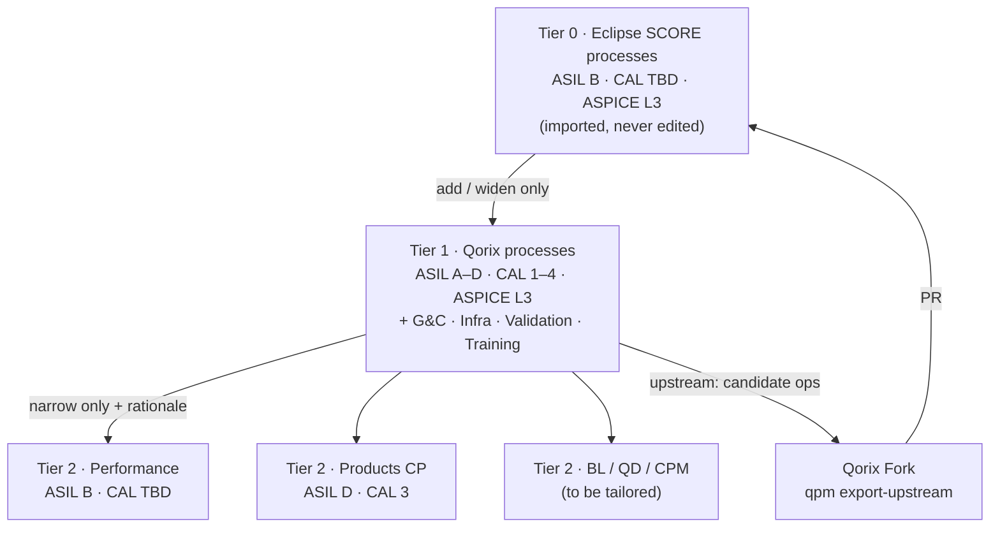
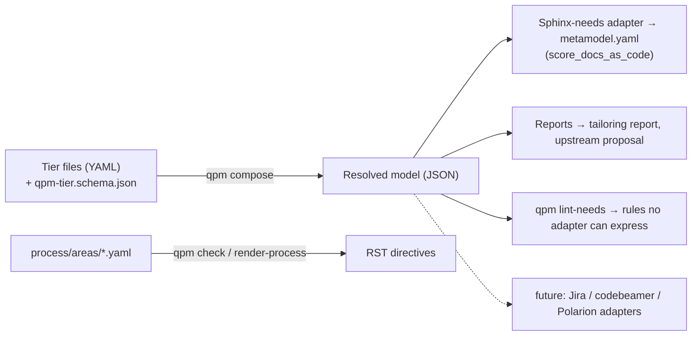

# Qorix Process Framework — Design

Version 0.1 · 2026-10-08 · Owner: Head of Governance & Compliance

## 1. Purpose and scope

All Qorix projects use one process framework, built from the Eclipse SCORE process baseline.
The framework is defined once in a technology-neutral metamodel (QPM), and the
Sphinx-needs/Bazel docs build is generated from that model.

| Brief item | Delivered as |
|---|---|
| 1. Framework usable for all org projects | Bazel module `qorix_process_framework`. Any repo consumes it with one macro: `qorix_docs(tailoring = …)` |
| 2. Workflow | Process areas G&C, Infrastructure, Validation and Training, modelled as workflows, work products and roles, and checked automatically |
| 3. Technology-independent design | QPM (YAML + JSON schema) is the source of truth. Sphinx-needs is one adapter. |

Out of scope for v0.1:

- the Production → Release → Portal flow;
- adapters other than Sphinx-needs (the plug-in point is defined in §3).

## 2. Framework architecture



| Tier | File | Allowed operations | Integrity |
|---|---|---|---|
| 0 · SCORE base | `model/tiers/00_score_base/` (generated by `qpm import-score`) | Full model (upstream) | ASIL B, CAL TBD, ASPICE L3 |
| 1 · Qorix overlay | `model/tiers/10_qorix/qorix_overlay.qpm.yaml` | `add_element_type`, `extend_element_type` (optional only), `extend_enum`, `add_relation_type`, `add_rule`, `add_forbidden_words` | ASIL A–D, CAL 1–4, ASPICE L3 |
| 2 · Project | `projects/<id>/tailoring.qpm.yaml` | `restrict_enum`, `require_attribute`, `exclude_element_type`, `add_rule` — each with `rationale` | Set by `asil_max`, `cal_max`, `aspice_target_level` |

`qpm compose` enforces the following rules:

- **Superset rule (overlay).** Anything valid against SCORE stays valid against Qorix, so Qorix content can move upstream unchanged.
- **Narrowing rule (project).** A project can only tighten the process. Every operation carries a rationale, and the tailoring file plus the generated tailoring report form the assessor's record.
- **Chain rule.** There is exactly one base, each tier extends the previous one, and the project tier comes last.
- **Integrity.** Every relation, target and prefix must resolve in the composed model.

**Qorix Fork.** `qpm export-upstream` applies only the overlay operations flagged `upstream: candidate`. It writes `upstream/score_proposal/` with three files: a `metamodel.yaml`, a `metamodel.diff` and a `PR_DESCRIPTION.md`. The current proposal holds 10 operations:

- ASIL A, C and D;
- an optional CAL attribute on 7 types;
- the ASIL D fulfilment rule;
- work-product links to concept and template.

**Reference projects:**

- **Performance.** Capped at ASIL B. CAL stays TBD, as in SCORE. `gc_finding` is excluded so the content stays pushable to SCORE.
- **Products CP.** Capped at ASIL D and CAL 3. CAL is mandatory on `feat_req` and `comp_req`.

## 3. Technology-independent design (QPM)



| QPM concept | Meaning | Sphinx-needs mapping |
|---|---|---|
| Element type | Kind of traceable item (requirement, WP, role, …) | Need type |
| Attribute | `enum` or `pattern`, required or optional | `mandatory_options` / `optional_options` |
| Relation | Typed link with allowed target types | `mandatory_links` / `optional_links` |
| Relation type | Forward / reverse names | `needs_extra_links` |
| Graph rule | Condition on linked items | `graph_checks` |
| Conditional-attribute rule | e.g. CAL required when `security == YES` | Not expressible → `qpm lint-needs` on `needs.json` |
| Lint | Forbidden words per field | `prohibited_words_checks` |
| Process catalog | Workflows, WPs, roles, concepts, templates | Rendered `workflow` / `workproduct` / `role` / `gd_temp` / `doc_concept` directives |

Design guarantees:

- **Lossless round trip.** The SCORE importer and the Sphinx-needs adapter are exact inverses. The test suite imports the upstream SCORE metamodel (52 types, 5 graph checks), emits it again, and asserts the result equals the original.
- **Adapter contract.** An adapter is `emit(model) -> (artifact, unsupported_rules)`. It must not drop semantics silently; anything it cannot express is enforced by `qpm lint-needs`.
- **One condition grammar.** Conditions use the SCORE graph-check grammar (`attr == value`, `and` / `or` / `not`), evaluated by `qpm/expr.py` for any non-Sphinx consumer.

## 4. Process workflow model

```
IN (WP) ──▶ [ WORKFLOW: activities ] ──▶ OUT (WP)
                 ▲            ▲
          ROLES (RWE)     GUIDANCE (templates, checklists)
R = responsible   W = approved_by (sign-off)   E = supported_by (expertise)

WORK PRODUCT = PURPOSE (content) + CONCEPT (has → doc_concept) + TEMPLATE (contains → gd_temp)
```

The Qorix tier adds 4 process areas with 11 workflows, 11 work products and 8 roles. It reuses SCORE roles and work products where they exist, through 29 cross-references into SCORE.

| Area | Workflows | Key outputs | Compliance links |
|---|---|---|---|
| Governance & Compliance | Maintain overlay · Tailor project · Compliance audit · SCORE upstream contribution | Process overlay, Tailoring record, Audit report (+ `gc_finding` needs), Upstream proposal | ISO 26262-2 5.5.1; ISO/SAE 21434 5.5.1, 5.5.5; ASPICE IIC 10-00, 15-13, 15-54 |
| Infrastructure | Maintain & qualify toolchain · Onboard repo | Toolchain baseline, Repo baseline, Tool verification report | ISO/SAE 21434 5.5.4; ASPICE IIC 13-55 |
| Validation | Define test policy · Qualify test system · Execute validation | Test policy, Test system spec, Validation report | Not yet mapped (§6) |
| Training | Maintain competence matrix · Deliver training | Competence matrix, Training material | ISO 26262-2 5.5.2; ISO/SAE 21434 5.5.2; ASPICE IIC 06-04 |

New Qorix roles:

- Head of G&C
- Process Owner
- Compliance Auditor
- Infrastructure Lead
- Infrastructure Engineer
- Validation Lead
- Validation Engineer
- Training Coordinator

New element types:

- `gc_finding` (audit findings, with `affects` and `evidence` links);
- `training` (`qualifies → role`).

`qpm check-process` blocks a merge if any of these fails:

- every reference resolves to the catalog or to the SCORE process (1,287-ID snapshot);
- responsible ≠ approver (four-eyes);
- every WP has a producing workflow, and every role is used;
- every activity performer is one of that workflow's roles;
- no Qorix ID collides with a SCORE ID (`qx` namespace).

## 5. Project onboarding and CI

1. Copy `projects/_template/tailoring.qpm.yaml`, set the integrity ceilings, and add narrowing ops with rationale.
2. Get it approved through `wf__qx_gc_tailor_project` (approver: Head of G&C).
3. In the repo, add `bazel_dep(name = "qorix_process_framework")` and call `qorix_docs(project = …, tailoring = …)` (see `examples/consumer_repo/`).
4. CI runs `bazel run //:docs_check`, `bazel run //:docs`, and `qpm lint-needs` on `//:needs_json`.

The framework's own CI (`.github/workflows/framework.yml`) has two jobs:

- **Python job:** self-tests, then `tools/regen.sh` followed by `git diff --exit-code`, so generated RST, tailoring reports and the upstream proposal can never drift.
- **Bazel job:** `qpm_test`, `docs_check`, `docs`.

## 6. Verification status and open points

| Check | Result |
|---|---|
| qpm self-tests (round trip, tiering rules, schema, catalog, lint) | 14 / 14 pass |
| Composed metamodels (qorix, performance, products_cp) loaded by SCORE's own `score_metamodel` YAML parser | All three load: 54 / 53 / 54 types |
| Rendered process RST built with plain Sphinx 8 + sphinx-needs 8.5 | Builds. The only warnings are 29 links to SCORE IDs, which `external_needs` resolves in the Bazel build. |
| `bazel run //:docs` with `score_docs_as_code` 8.3.0 | **Not run** — no Bazel in the build sandbox. It is the first thing to confirm in CI. |

Open points / decisions needed:

- [ ] Run the Bazel build in CI. The rules_python pins in `tools/qpm/requirements_lock.txt` are unverified.
- [ ] Decide the tailoring for BL, QD and CPM (ASIL / CAL ceilings).
- [ ] Map the Validation work products to ISO 26262-4 / -8 and ASPICE `std_*` IDs.
- [ ] Confirm the CAL policy for Performance (currently TBD, matching SCORE).
- [ ] Publish the framework to a Qorix Bazel registry, or use `git_override` until then.
- [ ] Reconcile with the existing Performance process-description site. It was not reachable (GitHub login), so it is not yet compared.
- [ ] Production → Release → Portal flow (next iteration).
