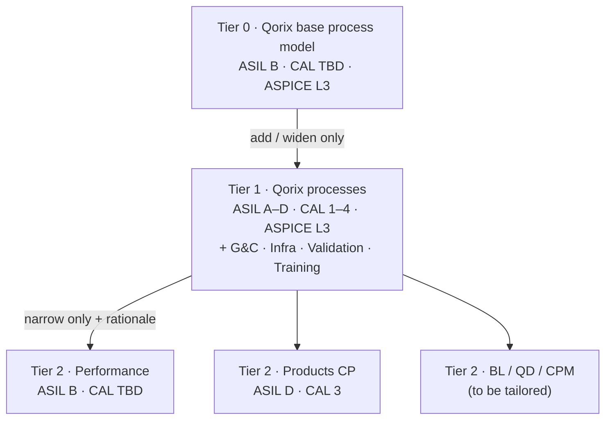
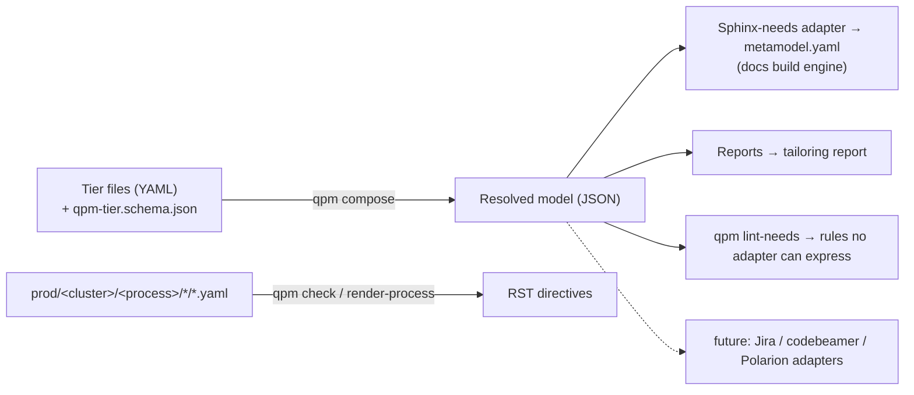

# Qorix Process Hub — Design

Version 0.1 · 2026-10-08 · Owner: Head of Governance & Compliance

## 1. Purpose and scope

All Qorix projects use one process hub, built on the Qorix base process model.
The framework is defined once in a technology-neutral metamodel (QPM), and the
Sphinx-needs/Bazel docs build is generated from that model.

| Brief item | Delivered as |
|---|---|
| 1. Framework usable for all org projects | Bazel module `qorix_process_framework`. Any repo consumes it with one macro: `qorix_docs(tailoring = …)` |
| 2. Workflow | Process areas G&C, Infrastructure, Validation and Training, modelled as workflows, work products and roles, and checked automatically |
| 3. Technology-independent design | QPM (YAML + JSON schema) is the source of truth. Sphinx-needs is one adapter. |

Out of scope for v0.1:

- the Production → Release → Portal flow;
- adapters other than Sphinx-needs (the plug-in point is defined in §3).

## 2. Framework architecture



| Tier | File | Allowed operations | Integrity |
|---|---|---|---|
| 0 · Qorix base | `prod/concepts/tiers/00_qorix_base/qorix_base.qpm.yaml` | Full model (changed via `wf_qx_gc_maintain_overlay`) | ASIL B, CAL TBD, ASPICE L3 |
| 1 · Qorix overlay | `prod/concepts/tiers/10_qorix/qorix_overlay.qpm.yaml` | `add_element_type`, `extend_element_type` (optional only), `extend_enum`, `add_relation_type`, `add_rule`, `add_forbidden_words` | ASIL A–D, CAL 1–4, ASPICE L3 |
| 2 · Project | `dist/<id>/tailoring.qpm.yaml` | `restrict_enum`, `require_attribute`, `exclude_element_type`, `add_rule` — each with `rationale` | Set by `asil_max`, `cal_max`, `aspice_target_level` |

`qpm compose` enforces the following rules:

- **Superset rule (overlay).** Anything valid against the base stays valid against Qorix.
- **Narrowing rule (project).** A project can only tighten the process. Every operation carries a rationale, and the tailoring file plus the generated tailoring report form the assessor's record.
- **Chain rule.** There is exactly one base, each tier extends the previous one, and the project tier comes last.
- **Integrity.** Every relation, target and prefix must resolve in the composed model.

**Reference projects:**

- **Performance.** Capped at ASIL B. CAL stays TBD. `gc_finding` is excluded; findings live in the project's issue tracker.
- **Products CP.** Capped at ASIL D and CAL 3. CAL is mandatory on `feat_req` and `comp_req`.

## 3. Technology-independent design (QPM)



| QPM concept | Meaning | Sphinx-needs mapping |
|---|---|---|
| Element type | Kind of traceable item (requirement, WP, role, …) | Need type |
| Attribute | `enum` or `pattern`, required or optional | `mandatory_options` / `optional_options` |
| Relation | Typed link with allowed target types | `mandatory_links` / `optional_links` |
| Relation type | Forward / reverse names | `needs_extra_links` |
| Graph rule | Condition on linked items | `graph_checks` |
| Conditional-attribute rule | e.g. CAL required when `security == YES` | Not expressible → `qpm lint-needs` on `needs.json` |
| Lint | Forbidden words per field | `prohibited_words_checks` |
| Process catalog | Workflows, WPs, roles, concepts, templates | Rendered `workflow` / `workproduct` / `role` / `gd_temp` / `doc_concept` directives |

Design guarantees:

- **Complete adapter.** The test suite checks that every element type and rule of the base model is either emitted by the Sphinx-needs adapter or handed to `qpm lint-needs`.
- **Adapter contract.** An adapter is `emit(model) -> (artifact, unsupported_rules)`. It must not drop semantics silently; anything it cannot express is enforced by `qpm lint-needs`.
- **One condition grammar.** Conditions use the docs engine's graph-check grammar (`attr == value`, `and` / `or` / `not`), evaluated by `qpm/expr.py` for any non-Sphinx consumer.

## 4. Process workflow model

```
IN (WP) ──▶ [ WORKFLOW: activities ] ──▶ OUT (WP)
                 ▲            ▲
          ROLES (RWE)     GUIDANCE (templates, checklists)
R = responsible   W = approved_by (sign-off)   E = supported_by (expertise)

WORK PRODUCT = PURPOSE (content) + CONCEPT (has → doc_concept) + TEMPLATE (contains → gd_temp)
```

Repository structure follows the ISO/IEC/IEEE 15288 system of interest: `needs/` (standards
catalogue), `prod/` (mission, concepts, realization and the assemblies) and `dist/` (one
tailoring per project). Each assembly is a process folder `prod/assemblies/<cluster>/<process>/` (inside a cluster assembly) with five
subcomponents: `process/`, `workflows/`, `work_products/`, `roles/` and `templates/`, each holding
its YAML source and its generated page. Assemblies carry an enabler / scope / layer
classification (PRD·TST·BLD·DOC·SAF·SEC / GLOB·FEAT·COMP·UNIT / INT·REQ·ARC·DES·IMP).

Identifiers follow `<type>_qx_<assembly code>_<name>` (e.g. `wf_qx_gc_tailor_project`); a double
underscore is rejected everywhere, including the base model's prefixes and ID patterns.

The Qorix tier holds 9 assemblies with 19 workflows, 30 work products (9 of them `origin: external`
inputs produced elsewhere), 14 roles and 16 templates. Safety, Security, Change Management,
Configuration Management and Quality Assurance are imported from the Qorix process house (qorix-ee)
and converted to the hub's ID scheme. Compliance links point to `needs/standards.yaml` (11 clauses).
Workflow links: `responsible`, `approved_by`, `supported_by`, `input`, `output`, `contains`, `has`;
work products link their concept (`has`) and template (`typed_by`) and comply with standard clauses
(`complies`). Lifecycle: draft → proposed → approved → released → deprecated → retired.

| Cluster / assembly | Workflows |
|---|---|
| compliance / governance_compliance (`gc`) | Maintain overlay · Tailor project · Compliance audit |
| compliance / safety (`saf`) | Maintain FSMS · Manage safety anomaly · Independent safety assessment |
| compliance / security (`sec`) | Maintain CSMS · Coordinate incident response |
| engineering / change_management (`cm`) | Manage organisation-level change |
| engineering / configuration_management (`cfg`) | Manage the process description |
| engineering / quality_assurance (`qa`) | Maintain QMS · Conduct internal audit |
| build / infrastructure (`infra`) | Maintain & qualify toolchain · Onboard repo |
| testing / validation (`val`) | Define test policy · Qualify test system · Execute validation |
| organisation / training (`trn`) | Maintain competence matrix · Deliver training |

New element types:

- `gc_finding` (audit findings, with `affects` and `evidence` links);
- `training` (`qualifies → role`).

`qpm check-process` blocks a merge if any of these fails:

- every reference resolves to the catalog or to the Qorix standards catalogue;
- responsible ≠ approver (four-eyes);
- every WP has a producing workflow (or is marked `origin: external` and is not produced here), and every role is used;
- every activity performer is one of that workflow's roles;
- every ID is unique, follows `<type>_qx_<code>_<name>` and has no double underscore; cluster, status and classification are valid.

## 5. Project onboarding and CI

1. Copy `dist/_template/tailoring.qpm.yaml` to `dist/<project>/`, set the integrity ceilings, and add narrowing ops with rationale.
2. Get it approved through `wf_qx_gc_tailor_project` (approver: Head of G&C).
3. In the repo, add `bazel_dep(name = "qorix_process_framework")` and call `qorix_docs(project = …, tailoring = …)` (see `examples/consumer_repo/`).
4. CI runs `bazel run //:docs_check`, `bazel run //:docs`, and `qpm lint-needs` on `//:needs_json`.

The framework's own CI (`.github/workflows/framework.yml`) has two jobs:

- **Python job:** self-tests, then `prod/realization/regen.sh` followed by `git diff --exit-code`, so generated RST and tailoring reports can never drift.
- **Bazel job:** `qpm_test`, `docs_check`, `docs`.

## 6. Verification status and open points

| Check | Result |
|---|---|
| qpm self-tests (adapter completeness, tiering rules, schema, catalog, lint) | 19 / 19 pass |
| `bazel run //:docs_check` and `//:docs` in CI | To be confirmed after the restructure (paths and IDs changed) |

Open points / decisions needed:

- [ ] Decide the tailoring for BL, QD and CPM (ASIL / CAL ceilings).
- [ ] Map the Validation work products to ISO 26262-4 / -8 and ASPICE `std_*` IDs.
- [ ] Confirm the CAL policy for Performance (currently TBD).
- [ ] Publish the framework to a Qorix Bazel registry, or use `git_override` until then.
- [ ] Production → Release → Portal flow (next iteration).
